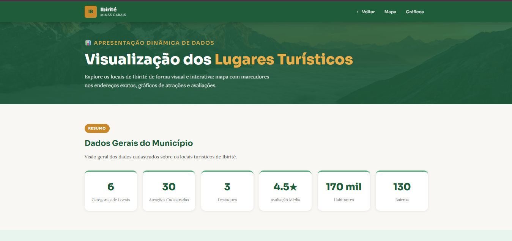
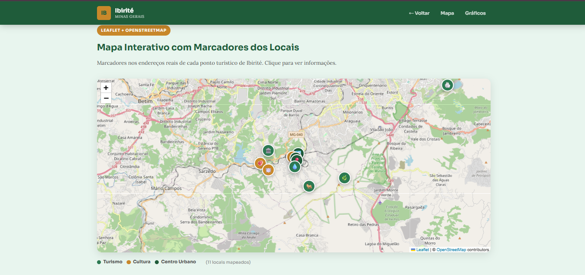
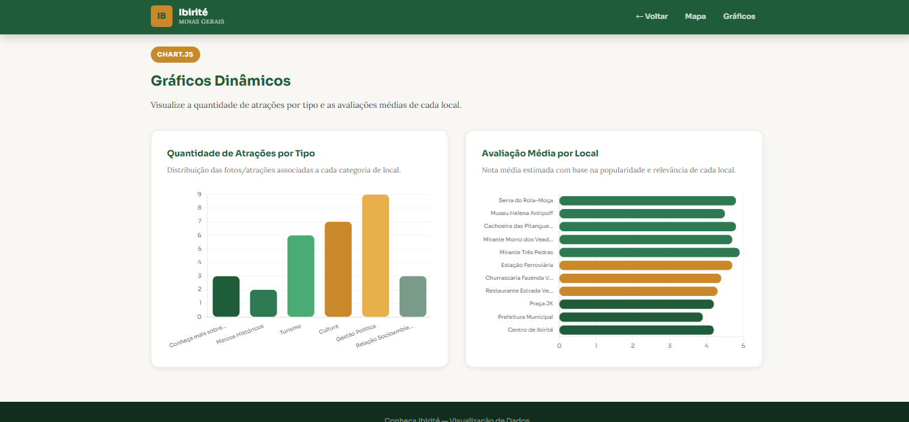

# SEMANA-14

## Informações Gerais

- Nome: Camila Victoria de Barros
- Matricula: 1659655
- Proposta de projeto escolhida: Lugares e Experiências
- Breve descrição sobre seu projeto: Estou criando um projeto sobre minha cidade, como se fosse um turismo digital

## Descrição do Projeto

Site estático e responsivo que apresenta os principais locais turísticos, históricos e culturais do município de Ibirité – MG, localizado na Região Metropolitana de Belo Horizonte. Os dados são manipulados via JavaScript com estrutura JSON e renderizados dinamicamente nas páginas. 

## Etapa Anterior (CRUD / Renderização Dinâmica)
- Listagem dinâmica de todos os locais via JavaScript (estrutura JSON)
- Carrossel automático com os locais em destaque
- Página de detalhes com fotos associadas
- Navegação responsiva com menu mobile

## Etapa Atual — Apresentação Dinâmica de Dados

- Mapa Interativo
- Gráfico de Barras
- Gráfico de Avaliação Média

## Prints

